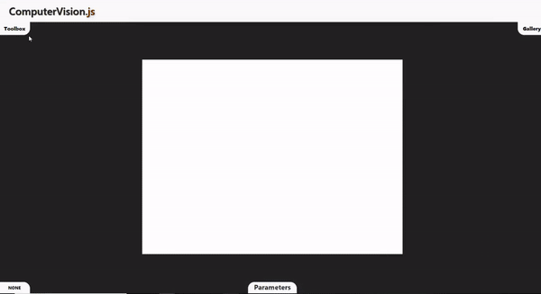
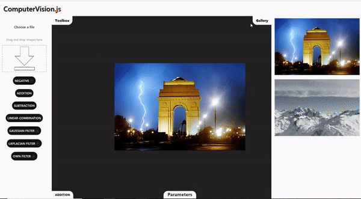

<header><h1>ComputerVision.js</h1></header>

    
The project has been created using a common JavaScript framework - ReactJS

    
The purpose of the project is to implement some of the CV(computer vision) algorithms

    
Currently there are implemented following algorithms:

    <ol>
        <li>negative</li>
        <li>addition</li>
        <li>subtraction</li>
        <li>linear combination</li>
        <li>Convolution</li>
        <li>Gaussian filtering</li>
        <li>Laplacian filtering</li>
    </ol>
    
Below we can see a mock algorithm(image addition)

    

        
    

	
	
Implemented convolution with chosen kernel by hand

    

        
    
